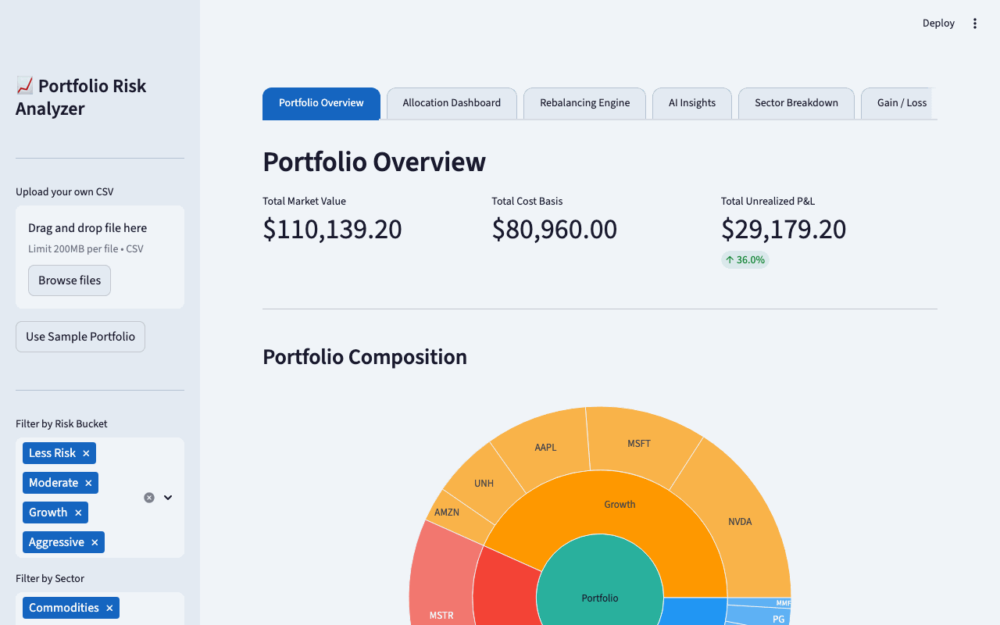
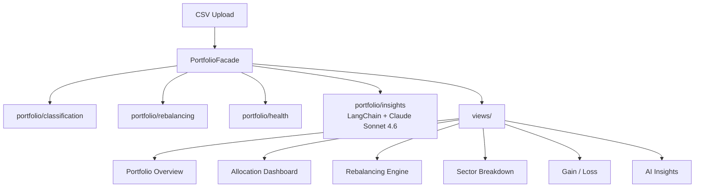
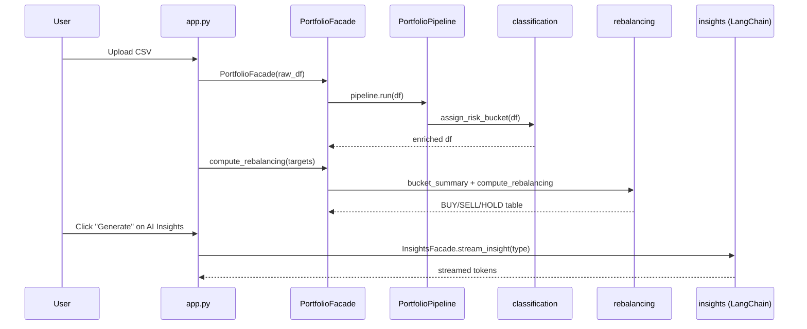
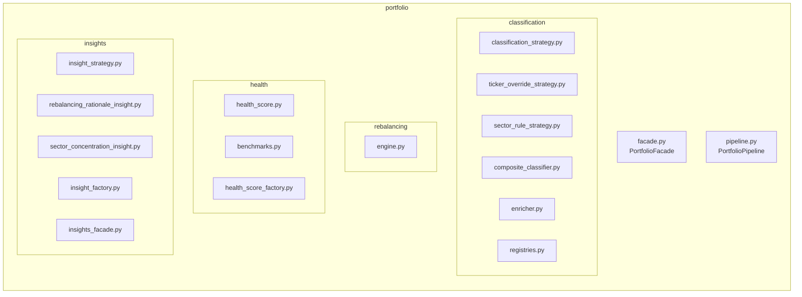

# Stock Portfolio Risk Analyzer

> AI-powered portfolio risk analysis built with Streamlit, LangChain, and Claude Sonnet 4.6

A vibe-coded Streamlit app that classifies every holding into a risk bucket, scores the portfolio against 3 benchmarks, computes precise rebalancing actions, and streams AI-powered insights — all from a single CSV upload.



---

## Quick Start

```bash
pip install -r requirements.txt
streamlit run app.py
```

For AI Insights, add your Anthropic API key to `.streamlit/secrets.toml`:

```toml
ANTHROPIC_API_KEY = "sk-ant-..."
```

The app runs fully without an API key — the AI Insights tab is always visible; Generate buttons are disabled with instructions when the key is absent.

---

## What it does

Upload a portfolio CSV with columns `ticker, name, sector, asset_type, shares, purchase_price, current_price`. The app auto-classifies every holding into one of four risk buckets (Less Risk / Moderate / Growth / Aggressive) using a two-layer rule: ticker-level overrides take priority over sector rules, allowing explicit exceptions like MSTR (Technology sector, but Aggressive due to Bitcoin exposure). It then scores the portfolio against three benchmark allocations, computes proportional BUY/SELL/HOLD actions to reach your target allocation, and streams AI analysis via Claude Sonnet 4.6.

---

## Architecture

### App layers



### Data flow



### Domain module layout



---

## Design Patterns

These patterns were chosen upfront based on production engineering experience and codified in `CLAUDE.md` before any code was written. They are the reason the codebase is readable, maintainable, and testable.

| Pattern | Where it's applied |
|---|---|
| **Facade** | `PortfolioFacade` — single entry point for all 6 views; no view imports `portfolio/` directly |
| **Strategy** | `ClassificationStrategy` for bucket rules; `InsightStrategy` for AI insight types |
| **Pipeline** | `PortfolioPipeline` — sequential DataFrame transforms (load → classify → enrich) |
| **Factory** | `HealthScoreFactory` for benchmark scores; `InsightFactory` for LangChain strategy instances |
| **Registry** | `TICKER_OVERRIDE`, `SECTOR_RULES`, `BENCHMARK_REGISTRY`, `INSIGHT_REGISTRY` |
| **Dependency Injection** | LLM injected into `InsightsFacade` and strategies — every AI class is testable with a mock |

---

## Testing

```bash
python3 -m pytest tests/ -v
```

48 unit tests across 4 files — all pass. Tests cover bucket classification, rebalancing math, health score scoring, and AI insight strategy logic (mocked LLM, no live API calls required).

---

## Project Structure

```
app.py                           Streamlit router
views/                           One render() per tab (overview, allocation, rebalancing, sector, gainloss, insights)
portfolio/
  facade.py                      PortfolioFacade (Facade pattern)
  pipeline.py                    PortfolioPipeline (Pipeline pattern)
  classification/                Risk bucket assignment (Strategy pattern)
  rebalancing/                   BUY/SELL/HOLD math engine
  health/                        Benchmark scoring (Factory + Registry patterns)
  insights/                      LangChain AI insight strategies (Strategy + Factory patterns)
tests/                           48 unit tests
data/portfolio_sample.csv        20 synthetic holdings
docs/plan-day*.md                Per-day architectural thinking and decisions
prompts.md                       Every prompt logged with learnings
google_doc_content.html          Full project narrative (copy-paste to Google Docs)
```

---

## Documentation

- [prompts.md](prompts.md) — every conversation arc logged with key observations
- [docs/plan-day1.md](https://github.com/gayyaswa/vibe-coding-app/blob/main/docs/plan-day1.md) — Day 1: architecture decisions (classification, rebalancing math, slider constraint)
- [docs/plan-day2.md](https://github.com/gayyaswa/vibe-coding-app/blob/main/docs/plan-day2.md) — Day 2: design patterns, views refactor, health score, theme
- [docs/plan-day3.md](https://github.com/gayyaswa/vibe-coding-app/blob/main/docs/plan-day3.md) — Day 3: AI insights, LangChain vs SDK, DI pattern, streaming UX
- [google_doc_content.html](google_doc_content.html) — full project narrative with all prompts, iterations, and learnings

---

Built with [Claude Code](https://claude.ai/code) · [Streamlit](https://streamlit.io) · [LangChain](https://python.langchain.com) · [Plotly](https://plotly.com)
